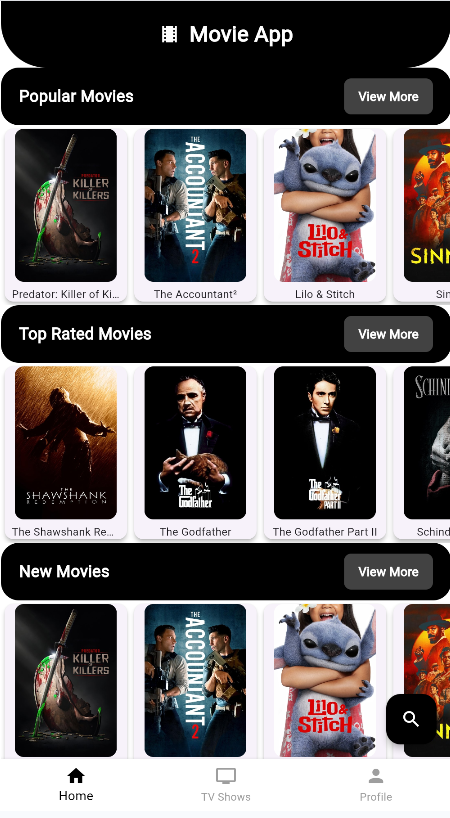
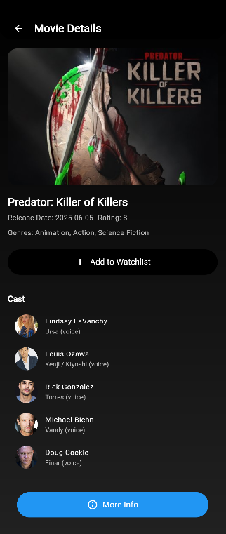
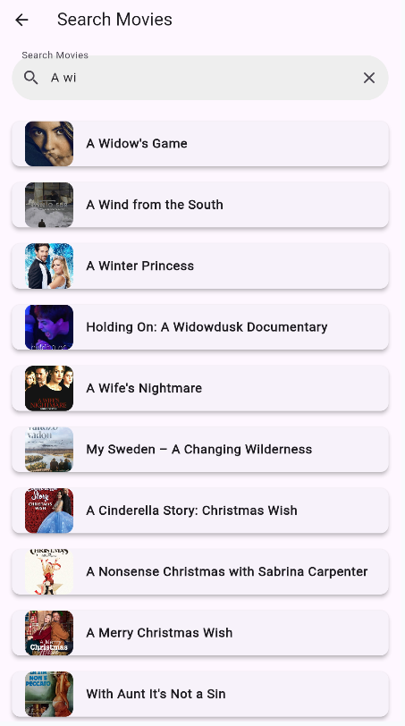
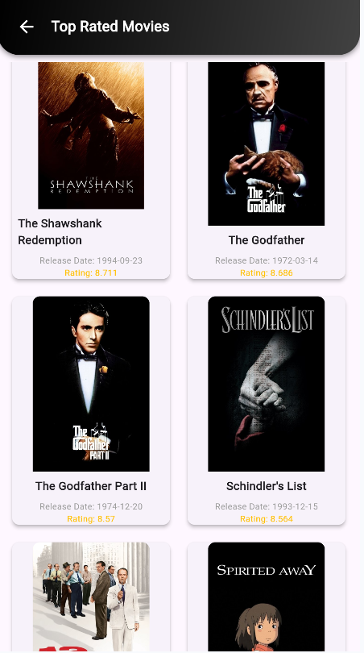
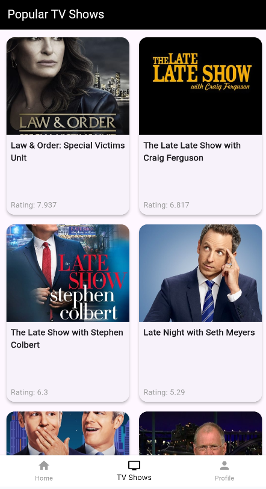
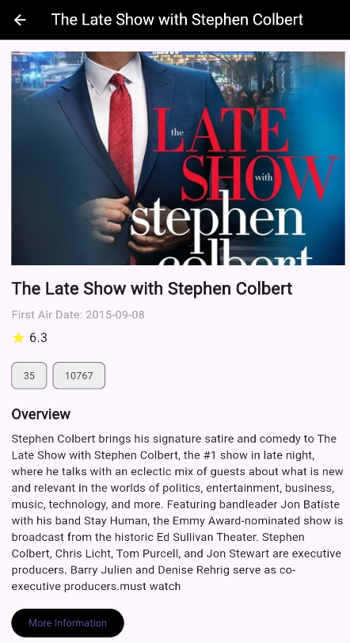

# 🎬 Movie App - Flutter

A beautifully designed Flutter application to browse and explore movies. The app features categories like popular, top-rated, and now-playing movies. Users can view details such as poster, title, release date, rating, and overview.

---

## 🚀 Features

- Browse movies by category
- View detailed information about each movie
- Smooth and responsive UI
- Search functionality 
- Scrollable movie lists with clean layouts

---

## 🛠️ Built With

- **Flutter** – UI Toolkit
- **Dart** – Programming Language
- **http** – For API calls (if used)
- **VS Code / Android Studio** – Development tools

---

## 📱 Screenshots

### 🏠 Home Screen

### 🎬 Movie Details

### 🔍 Search

### 🔍 View More

### 🔍 Tv Shows

### 🔍 Tv Shows Details

---

## 🧑‍💻 Author

- **Zeal R.**
- [GitHub: @zealr3](https://github.com/zealr3)

---

## 📌 Note

This project is for learning and portfolio purposes. You are welcome to explore and use the code for educational use.

---

## ⭐️ Show Support

If you find this useful, please ⭐️ the repo and follow!

